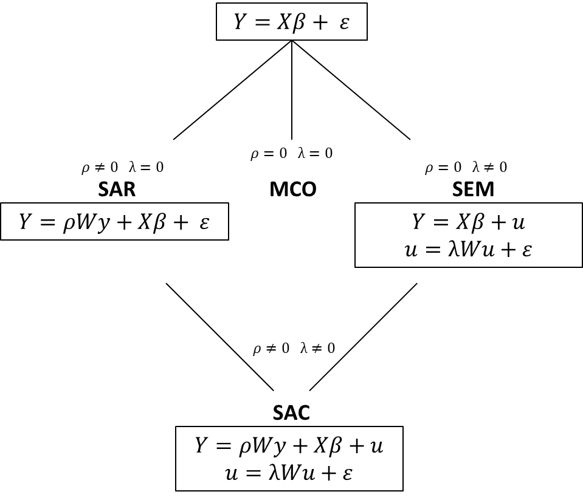
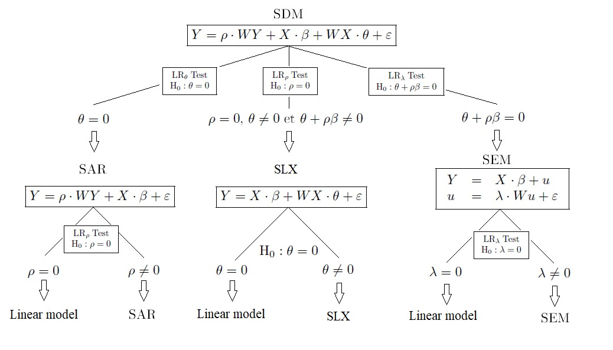
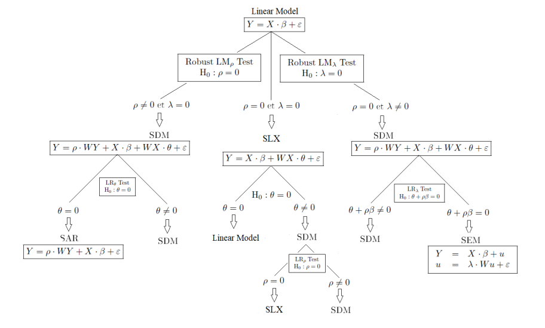

```{css my-header-colors, echo = FALSE}
.page-header {
    background-image: url(logo.png);
    background-color: #5F698C;
    background-repeat: no-repeat;
    background-position: center center;
    height: 100px;
}
```

```{=html}
<style>
.html-widget {
    margin: auto;
}
</style>
```

<center><font size="7"> **Ciencia de Datos Geográficos aplicada a la Política Pública** </font></center>

<br></br>

<font size="4"> [Dr. Juan Pablo Carranza](https://carranzajuanp.github.io/cv/) </font>

<br></br>

# Introducción al manejo de datos territoriales

El objetivo de este taller consiste en:

-   Introducirse en el manejo de distintos tipos de datos geográficos para la representación territorial de la investigación social.

-   Incorporar herramientas para la representación de datos geográficos en mapas estáticos y en mapas interactivos.

-   Adquirir los conocimientos necesarios para continuar de manera autogestiva la exploración de las posibilidades del ecosistema R, aplicado a los propios problemas de investigación.

-   Repasar de manera introductoria algunos elementos básicos de modelos de econometría espacial.

-   Repasar algunas herramientas para la aplicación de técnicas de aprendizaje computacional a los fenómenos territoriales.

Durante el cursado de este módulo haremos un uso intensivo de la librería **sf** [@pebesma2023]. Esta librería implementa en R un manejo eficiente y estandarizado de datos espaciales utilizando el modelo de geometrías de características simples (o simple features), un estándar internacional definido por ISO 19125 y desarrollado por el Open Geospatial Consortium (OGC). Este modelo es ampliamente utilizado en herramientas de software geográfico como GeoJSON, ArcGIS, QGIS, PostGIS, MySQL Spatial Extensions, y Microsoft SQL Server, facilitando la interoperabilidad y el análisis de datos geoespaciales en diversos entornos.

En R, el paquete **sf** proporciona una representación poderosa y flexible de datos espaciales vectoriales. Los objetos principales que maneja son extensiones de los clásicos data frames o tibbles, y están diseñados para facilitar la integración con otras herramientas de análisis de datos en R. Cada objeto del tipo sf incluye una columna especial denominada simple feature geometry list column, que almacena la geometría de cada observación en un formato tipo lista. Esta geometría se asocia con una o más variables adicionales (atributos) que describen cada entidad geográfica, lo que convierte cada fila en una simple feature o característica simple, compuesta tanto por sus atributos como por su estructura geométrica.

Además, sf introduce una serie de funciones que permiten realizar transformaciones geométricas, operaciones topológicas y análisis espaciales de manera eficiente, aprovechando bibliotecas subyacentes como GEOS, GDAL y PROJ. Este enfoque no solo facilita la manipulación de datos geoespaciales, sino que también asegura una alta compatibilidad con los formatos y herramientas geográficas más utilizados a nivel global.

Para comenzar, instalamos la librería y la cargamos a nuestro entorno de trabajo:

```{r, message=FALSE, eval=F}
install.packages("sf")
library(sf)
```

```{r, message=FALSE, include=F, echo=F}
library(sf)
```

## Tipos de datos espaciales

Es importante distinguir entre los dos tipos principales de datos espaciales: datos **vectoriales** y datos **raster**. Ambos tipos de datos permiten representar información geográfica, pero lo hacen de manera muy diferente.

### Datos vectoriales

Los datos vectoriales son el enfoque utilizado por la librería **sf** y se basan en representaciones geométricas precisas de objetos espaciales a través de **puntos, líneas y polígonos**. Estos son comúnmente llamados features o características simples. Los tipos principales de geometrías que manejan los datos vectoriales son:

#### Puntos

Representan ubicaciones específicas en un espacio de coordenadas. Cada punto está definido por un par de coordenadas (x, y) en el espacio 2D, o (x, y, z) en el espacio 3D.

Para comprender mejor la lógica, vamos a crear un punto en el espacio bidimensional de las variables *x* e *y*. En primer lugar, definimos un vector con las coordenadas que asignaremos a este punto:

```{r}
coordenadas = c(5,3)
coordenadas
```

Es decir, el punto estará ubicado en el plano carteriano en una localización definida por x = 5 e y = 3.

A continuación, utilizamos la función *st_point* para convertir a este vector en un objeto espacial, a partir de esas coordinadas definidas previamente:

```{r}
punto <- st_point(coordenadas)
punto
```

Si graficamos este objeto, observamos lo siguiente:

```{r, fig.align='center'}
plot(punto, axes = TRUE)
```

Si bien este punto está localizado en el plano cartesiano a partir de los valores 5 (para x) y 3 (para y), la lógica aplica cuando estos valores no representan ejes abstractos sino un sistema de coordenadas dado por la latitud y la longitud. En estos casos, como veremos más adelante, el punto estaría localizado sobre el espacio geográfico.

También podríamos contar con una colección de puntos dentro de un mismo objeto. Para ver esto, en primer lugar definimos un vector de valores para x junto con un vector de valores para y, haciendo:

```{r}
px = c(5, 4, 2)
py = c(3, 5, 4)
```

Ahora, combinamos este conjunto de valores en un mismo data frame mediante la función cbind():

```{r}
coordenadas <- cbind(px, py)
coordenadas
```

Como se puede apreciar, el primer punto estará ubicado en la localización definida por los valores x = 5 e y = 3. El segundo en la localización dada por x = 4 e y = 5, y el tercer punto en la localización definida por el par ordenado x = 2 e y = 4.

Al igual que en el caso de un solo punto, convertimos a este data frame en un objeto espacial, pero ahora utilizando la función st_multipoint():

```{r}
puntos <- st_multipoint(coordenadas)
puntos
```

Graficando este objeto:

```{r, fig.align='center'}
plot(puntos, axes = TRUE)
```

#### Líneas

Las líneas son secuencias de puntos conectados que representan entidades lineales como caminos, ríos o vías de tren. Para comprender la lógica de este tipo de datos vectoriales, comencemos por definir un conjunto de coordenadas para la línea "l1".

```{r}
l1x <- c(0, 3, 5, 8, 10)
l1y <- c(0, 4, 4, 8, 10)
coordenadas_l1 <- cbind(l1x, l1y)
coordenadas_l1
```

Es decir que la línea l1 partirá el origen (en donde x = 0 e y = 0), luego se dirigirá hacia el punto dado por x = 3 e y = 4, luego pasará por x = 5 e y = 4, y proseguirá su viaje hasta arribar a destino en la localización dada por el punto x = 10 e y = 10.

A partir de estas coordenadas, vamos a crear un objeto espacial utilizando la función st_linestring():

```{r, fig.align='center'}
l1 <- st_linestring(coordenadas_l1)
plot(l1, axes = TRUE)
```

A continuación, podemos repetir el mismo procedimiento para crear una línea diferente en el mismo espacio cartesiano:

```{r, fig.align='center'}
l2x <- c(2, 3, 12)
l2y <- c(4, 8, 5)
coordenadas_l2 <- cbind(l2x, l2y)
l2 <- st_linestring(coordenadas_l2)
plot(l2, axes = TRUE)
```

Finalmente, podemos combinar ambas líneas en un mismo objeto espacial, haciendo uso de la función st_multilinestring():

```{r, fig.align='center'}
lineas <- st_multilinestring(list(l1, l2))
plot(lineas, axes = TRUE)
```

#### Polígonos

Los polígonos son representaciones formadas por líneas que encierran un área, como límites de países, lagos o áreas protegidas. Para comprender la lógica de este tipo de datos vectoriales, comencemos por definir un conjunto de coordenadas para un polígono imaginario en el plano cartesiano.

```{r}
x <- c(5, 10, 10, 6, 5)
y <- c(1, 2, 5, 4, 1)
coordenadas <- cbind(px, py)
coordenadas
```

La conformación del polígono parte de la lectura de esta lista de localizaciones en sentido antihorario. Es decir, la línea que define el contorno del polígono partirá, por ejemplo, del punto dado por x = 5 e y = 1. De allí se dirigirá hacia el punto localizado en x = 10 e y = 2. La línea continuará su viaje por cada uno de estos puntos que marcan los vértices del polígono, para arribar finalmente, de nuevo al punto de partida, dado por x = 5 e y = 1. Para convertir esta lista de coordenadas en un objeto espacial, utilizamos la función st_polygon():

```{r, eval=F}
poligono <- st_polygon(list(coordenadas))
```

Si graficamos este objeto, tenemos que:

```{r, echo=F, include=F}
load("poly.Rda")
```

```{r, fig.align='center'}
plot(poligono, axes = T)
```

#### Colecciones geométricas

Combinaciones de puntos, líneas y/o polígonos en un solo objeto. Cada una de estas geometrías puede estar acompañada de atributos, como por ejemplo el nombre de una ciudad para un punto, la longitud de una ruta para una línea, o la población de un área para un polígono. Estos atributos permiten realizar análisis espaciales avanzados y crear mapas temáticos. Para armar un objeto espacial que consista en una colección de los puntos, líneas y polígonos construidos anteriormente, utilizamos la función st_geometrycollection().

```{r, fig.align='center'}
coleccion <- st_geometrycollection(list(puntos, lineas, poligono))
plot(st_sfc(coleccion), axes = TRUE)
```

### Datos raster

A diferencia de los datos vectoriales, los datos raster dividen el espacio geográfico en una cuadrícula regular de celdas o píxeles. Cada celda contiene un valor numérico que representa información continua o discreta, como la elevación de un terreno, la temperatura en una región o la clasificación del uso del suelo. Los datos raster son ideales para representar fenómenos que varían de manera continua en el espacio, como el clima, la geología o las imágenes satelitales.

A pesar de que la librería **sf** está centrada en datos vectoriales, es común trabajar en conjunto con datos raster, utilizando otras librerías en R como **raster** [@raster] o **terra** [@terra] para gestionar y analizar este tipo de datos. Las herramientas modernas permiten realizar análisis espaciales combinados, aprovechando tanto los datos vectoriales (por ejemplo, límites políticos o redes de transporte) como los datos raster (por ejemplo, modelos de elevación digital o imágenes satelitales).

Estructuralmente, los rásters consisten en matrices de valores. Para comprender mejor la lógica de este tipo de objetivos, en primer lugar, construimos una matriz de la siguiente manera:

```{r}
matriz <- matrix(c(1, 2, 3, 4, 2, NA, 2, 2, 3, 3, 3, 1), ncol = 4, nrow = 3, byrow = TRUE)
matriz
```

A continuación, vamos a utilizar la librería **raster** para convertir esta matriz en un objeto espacial. Primero, instalamos la librería:

```{r, eval=FALSE}
install.packages("raster")
```

Posteriormente la cargamos al entorno de trabajo, y utilizamos la función raster() para lograr el objetivo:

```{r, fig.align='center'}
library(raster)
r <- raster(matriz)
plot(r)
```

Como se observa en el gráfico, el raster contiene diferentes valores para cada celda. Los valores más bajos se representan en color gris, en tanto que lo valores más altos se representan en color verde. Las celdas representan la estructura de la matriz, en donde, por ejemplo, en la tercera fila (la de abajo) y la tercera columna (la de la derecha) el valor de la celda es igual a 1, mientras que en la primera fila (la de arriba) y la tercera columna el valor asociado es igual a 4. La intersección entre la segunda fila y la segunda columna de la matriz tiene asociado el valor NA, que se representa como una celda en blanco en el gráfico. En R, NA representa un valor faltante o no disponible (Not Available). Es la forma en que R indica que no tiene un valor para una observación en particular, lo que puede suceder por diversas razones, como datos incompletos, errores de entrada o valores omitidos.

## Extrayendo datos geográficos abiertos

La comunidad de R ha generado diferentes herramientas para la extracción de datos libres y abiertos de naturaleza geográfica. Una excelente fuente de información de este tipo es Openstreetmap (OSM) [@openstreetmap2023], que consiste en un proyecto colaborativo que tiene como objetivo crear un mapa mundial libre y editable por cualquier persona. Se basa en la filosofía de crowdsourcing, lo que significa que los datos del mapa son generados y mantenidos por voluntarios de todo el mundo, quienes contribuyen con información sobre calles, edificios, parques, ríos, y muchos otros elementos geográficos. Para compensar la utilización gratuita de información de la cual gozaremos gracias al esfuerzo desinteresado de miles de personas que aportan información al mapa, recomendamos que las personas se creen un usuario en OSM y naveguen por el mapa, contribuyendo a sumar información de sus entornos y a elevar la calidad del mapa colaborativo. Esto puede realizarse en el [www.openstreetmap.org/](https://www.openstreetmap.org/). El [siguiente link](https://wiki.openstreetmap.org/wiki/ES:Gu%C3%ADa_de_principiantes) contiene una guia paso a paso para comenzar a colaborar con el mapeo.

La librería **osmdata** [@osmdata] permite extraer datos desde la API de OSM, por lo tanto, comenzamos por instalarla. También instalaremos la librería **nominatimlite** [@nominatimlite], que necesitaremos para definir entorno geográficos conocidos sólo a partir de su nombre:

```{r, eval=FALSE}
install.packages("osmdata")
install.packages("nominatimlite")
```

A continuación, vamos a definir un entorno geográfico (un polígono) sobre el cuál se acotará la extracción de información de OSM. Este polígono vendrá definido por los límites administrativos de la Municipalidad de Córdoba:

```{r, message=F}
library(nominatimlite)
library(osmdata)
area_de_estudio <- geo_lite_sf(address = "Cordoba, Argentina", points_only = F)
```

Veamos un poco más de cerca el polígono *area_de_estudio*:

```{r}
area_de_estudio
```

Ya entraremos en más detalles respecto a este objeto, pero por lo pronto, notemos que tiene la estructura de un data frame, con una sola fila en donde se observan las siguientes columnas: `r names(area_de_estudio)`. La última columna es la que nos interesa en este momento, dado que es una lista de coordenadas geográficas que nos permitirá visualizar este objeto en un mapa.

Para ello, vamos a hacer uso de la librería **mapview** [@mapview], que permite la construcción de mapas interactivos de una manera muy sencilla. Instalamos esta librería:

```{r, eval=FALSE}
install.packages("mapview")
```

Y a continuación, construimos el mapa:

```{r}
library(mapview)
mapview(area_de_estudio)
```

Al hacer click en el polígono notamos que se abre una ventana con el resto de la información contenida en las columnas restantes. Esta es la principal ventaja de la librería **sf**, que permite mantener la lógica de data frames al trabajar con objetos espaciales.

Ahora que hemos acotado el área sobre la cuál nos interesa extraer información, utilizaremos la librería **osmdata** para hacernos de la información necesaria para ejemplificar los diferentes tipos de objetos espaciales que hemos estado estudiando.

El siguiente bloque de código crea el objeto espacial "comercios" mediante la siguiente lógica: en primer lugar se utiliza la función opq() para acceder al servicio de descarga de información de OSM (una API) definiendo el área sobre la cuál se necesitará extraer la información. Esta área la hemos definido con el polígono "area_de_estudio" que representa los límites administrativos de la ciudad de Córdoba. En segundo lugar, utilizamos la función add_osm_feature() para definir qué tipo de datos queremos extraer de OSM. Openstreetmap tiene una manera de catalogar la información que la comunidad carga, definiendo diferentes códigos para diferentes tipos de objetos. Estos códigos pueden tener un primer agrupamiento, dado por el valor "key", y un segundo agrupamiento dado por el valor "value". En el ejemplo, nos interesa descargar todos los comercios (shops) en el área de estudio, pero podríamos estar interesados en descarga sólo las panaderías (bakery). En este hipotético caso, deberíamos reemplazar la línea correspondiente por *add_osm_feature(key = "shop", value = "bakery")*. Una exploración detallada de los diferentes criterios de catalogación de la información en OSM se puede realizar en el [siguiente link](https://wiki.openstreetmap.org/wiki/Tags).

```{r}
comercios <-  opq(st_bbox(area_de_estudio)) %>%
  add_osm_feature(key = "shop") %>%
  osmdata_sf()
```

Veamos un poco más de cerca el objeto recientemente creado, llamado "comercios":

```{r}
comercios
```

De lo anterior se desprende que este objeto contiene `r nrow(comercios$osm_points)` puntos, y `r nrow(comercios$osm_polygons)`. Esto se debe a que los usuarios pueden marcar la localización de un comercio con un punto, pero también dibujar un polígono que describa grandes superficies comerciales como los shoppings o ferias. Ya veremos cómo trabajar sobre esta dispersión de criterios, pero de momento, vamos a quedarnos sólo con los `r nrow(comercios$osm_points)` puntos.

```{r}
comercios = comercios$osm_points
```

Veamos un poco en detalle el resultado. La función dim() nos informa sobre la dimensión del data frame resultante.

```{r}
dim(comercios)
```

Como vemos, el objeto "comercios" tiene `r dim(comercios)[[1]]` filas y `r dim(comercios)[[2]]` columnas. Es mucha información. Si utilizamos la función names() podemos ver los nombres de cada una de estas columnas:

```{r}
names(comercios)
```

El objeto tiene una columna de geometría (la última) que define las coordenadas geográficas de cada punto, pero también muchas columnas con información adicional, que el usuario que realiza la carga de la información puede o no completar.

Para reducir el ruido de la información resultante, vamos a quedarnos sólo con la columna "shop", que indica el rubro de negocio al cual se dedica cada uno de los comercios:

```{r}
comercios = comercios[, c("shop")]
head(comercios)
```

Y a continuación podemos crear un mapa interativo con los datos resultantes:

```{r, warning=F}
mapview(comercios, col.regions = "blue", legend = F)
```

Siguiendo el procedimiento anterior, podemos también extraer otros tipos de objetos espaciales. Por ejemplo, las líneas que representan calles o avenidas catalogadas como "vias secundarias". Para ello, en la función add_osm_feature() utilizamos la key "highway" y el value "secondary".

```{r}
vias_secundarias <- opq(st_bbox(area_de_estudio)) %>%
  add_osm_feature(key = "highway", value = "secondary") %>%
  osmdata_sf()
vias_secundarias = vias_secundarias$osm_lines[, c("name")]
mapview(vias_secundarias, color = "blue", legend = F)
```

Por supuesto, también podemos extraer polígonos. En este caso, por ejemplo, extraeremos los polígonos de las escuelas localizadas dentro del área de estudio haciendo uso de la key "amenity" y el value "school". Entonces:

```{r, warning=FALSE}
escuelas <- opq(st_bbox(area_de_estudio)) %>%
  add_osm_feature(key = "amenity", value = "school") %>%
  osmdata_sf()
escuelas = escuelas$osm_polygons[, c("name")]
mapview(escuelas, color = "black", col.regions = "red", legend = F)
```

A continuación, exploraremos algunas estrategias para utilizar datos en formato ráster. Para ello, necesitaremos instalar previamente las librerías **terra** y **geodata** [@geodata].

```{r, eval=FALSE}
install.packages("terra")
install.packages("geodata")
```

A continuación, utilizaremos la librería **geodata** para descargar un modelo digital de elevación en formato ráster. Esta librería permite acceder a informacion libre generada en el marco de la mision Shuttle Radar Topography Mission (SRTM), que determina la elevacion del terreno (en metros sobre el nivel de mar) a traves de un radar incorporado a un satelite. Dado que la informacion se encuentra "precargada" en mozaicos que cubren diferentes extensiones geográficas, se le debe indicar a la función elevation_3s() las coordenadas geográficas de un punto, para que a partir de esta información se puede determinar qué mosaico se va a descargar.

Ahora bien, hasta aquí hemos definido el área de estudio como un polígono definido por el objeto *area_de_estudio*. Como ya sabemos, este polígono no tiene sólo una, sino varias coordenadas que, leidas en sentido antihorario, definen los límites del área. Y la función requiere de sólo un par de coordenadas, es decir, de un punto. Para sortear este inconvneiente, utilizaremos la función st_centroid() de la librería **sf**, que permite calcular el centroide de un polígono, entendido como el punto central de un polígono que se calcula a partir del promedio de las coordinadas geográficas que lo definen. Por lo tanto:

```{r, warning=F}
coordenadas = st_centroid(area_de_estudio)
```

A continuación, a este nuevo objeto espacial que representa el centroide del polígono del área de estudio, le extraeremos las coordenadas mediante la función de **sf** st_coordinates:

```{r}
coordenadas = st_coordinates(coordenadas)
coordenadas
```

En donde X representa la longitud (este-oeste) e Y representa la latitud (norte-sur). Ahora sí, estamos en condiciones de utilizar estas dos coordenadas geográficas para indicarle a la función elevation_3s() de la librería **geodata** el lugar para el cual queremos descargar la información sobre la elevación del terreno. La función tiene varios arguementos: el primero (lon) requiere que se informe la longitud calculada recién (el valor de X), y para asgnar ese valor tomamos el primer elemento del objeto *coordenadas*; para informar la latitud (lat) hacemos lo mismo pero con el segundo elemento del objeto *coordenadas*; finalmente, el argumento "path" requiere informar la ruta en la cual se guardará el archivo a descargar, en donde indicamos que se almacene en un directorio temporal (esto lo pueden modificar ustedes, detallando un directorio específico en sus computadoras):

```{r}
library(geodata)
library(terra)
elevacion <- elevation_3s(lon = coordenadas[[1]], lat = coordenadas[[2]], path=tempdir() )
```

Podemos graficar el ráster descargado:

```{r, fig.align='center'}
plot(elevacion)
```

También podemos hacer un mapa interactivo utilizando la librería **mapview**, pero aparece un pequeño inconveniente. El objeto "elevación" es de tipo `r class(elevacion)[[1]]`, que es el formato con el que la librería **terra** trabaja los rásters. Dado que **mapview** es una librería diseñada con anterioridad a la aparición de la librería **terra**, la interacción de ambas no es óptima. Para sortear este problema, convertimos el objeto "elevación" de `r class(elevacion)[[1]]` a un ráster clásico de la librería **raster**.

```{r, warning=FALSE}
mapview(raster(elevacion))
```

Sin embargo, el ráster descargado es mucho más amplio que el área de estudio definida. Para adecuar esta información hacemos uso de la función crop() de la librería **terra**, de la siguiente manera:

```{r, fig.align='center'}
cordoba = crop(elevacion, area_de_estudio)
plot(cordoba)
```

Y al igual que recién, podemos hacer un mapa interactivo con la salvedad de convertir el objeto "cordoba" al formato correpondiente:

```{r, warning=FALSE}
mapview(raster(cordoba))
```

<br></br>

## Cargar datos de manera local (desde la PC)

Si bien hasta ahora hemos descargado una amplia gama de archivos con datos espaciales directamente desde internet, hay muchas fuentes de información que no tienen sevicios para conectarse directamente y requieren de la descarga previa de algún archivo. Los archivos en formato geográfico más conmunes son aquellos con las extensiones *gkpg*, *kmz*, *geojson* o *shp*. Sin embargo, cualquier archivo que tenga una columna con la lista de coordenadas geográficas de cada fila puede convertirse en un objeto espacial, incluso una simple hoja de cálculo.

Vamos a utilizar la función st_read() de la librería *sf* para cargar al entorno de trabajo el archivo *barrios_cordoba.gpkg*, creando un nuevo objeto llamado "barrios", y generamos el mapa interactivo correspondiente:

```{r, message=FALSE}
barrios <- st_read("barrios_cordoba.gpkg")
mapview(barrios)
```

Como se mencionó, existen muchos portales que ofrecen descargas de información geográfica que puede ser luego cargada de esta manera al entorno de trabajo en R. Recomendamos revisar los portales [poblaciones.org](https://poblaciones.org/), [datos abiertos de la Municipalidad de Córdoba](https://gobiernoabierto.cordoba.gob.ar/data/datos-abiertos/categoria/geografia-y-mapas), el portal de la [Infraestructura de Datos Espaciales de la Provincia de Córdoba](https://www.mapascordoba.gob.ar/#/mapas), el portal del [INDEC](https://www.indec.gob.ar/indec/web/Institucional-Indec-Codgeo). Y hay muchos otros.

## Operaciones con datos espaciales

A continuación, analizaremos algunas funciones de la librería **sf** que permiten realizar diferentes operaciones con datos espaciales. Comenzaremos por la realización de uniones entre diferentes objetos espaciales. La lógica de esta operación implica, por ejemplo, identificar los atributos de objetos que comparten una localización o localizaciones próximas.Supongamos que nos interesa imputar a cada escuela el barrio al que pertenece. Para ello, utilizaremos la función st_join(). Esta función tiene 3 argumentos. En primer lugar se indica el objeto espacial sobre el que se desea agregar un atributo correspondiente a otro objeto espacial, en este caso, las escuelas. En segundo lugar se indica el objeto espacial desde dónde se desea transferir el atributo correspondiente, en este caso, el nombre del barrio. En tercer lugar, se debe indicar el criterio de union. En este caso, se indica la opción "st_intersects" que establece que ambos objetos deben unirse siempre que se intersecten en algún punto. Hay un cuarto argumento, que no es obligatorio utilizar, pero suele ser útil: se trata de a opción "largest". En el caso de asignarle el valor "TRUE", y en el frecuente caso de que una feature de un objeto se intersecte con dos o más features del otro objeto (por ejemplo, que una escuela esté ubicada en el límite de dos barrios, con una parte en uno y otra parte en otro) esta opción vinculará los datos de aquellas que compartan la mayor proporción del espacio.

```{r, echo=FALSE, include=FALSE}
escuelas = st_transform(escuelas, 4326)
barrios = st_transform(barrios, 4326)
barrios = sf::st_make_valid(barrios)
```

```{r}
escuelas = st_join(escuelas, barrios[,c("description")], join = st_intersects, largest = TRUE)
head(escuelas)
```

Como vemos, se ha agregado una columna que informa el barrio al que pertenece cada escuela.

Ahora, con esta nueva información, podemos realizar algunas agregaciones no espaciales, pero que tendrán correlato a nivel geográfico. Por ejemplo, supongamos que nos interesa saber la cantidad de escuelas que hay en cada barrio. Para ello, recuperando lo estudiado en módulos anteriores, hacemos uso de las funciones group_by() y summarise() de la librería **dplyr** [@dplyr]. Antes de proceder a calcular ese resumen de cantidad de escuelas por barrio, vamos a remover los atributos espaciales del objeto "escuelas". Esto lo haremos utilizando la función st_drop_geometry(), que básicamente convierte a data frame todo objeto espacial. Entonces

```{r, message=FALSE}
library(dplyr)
tabla <- st_drop_geometry(escuelas) %>% 
  group_by(description) %>% 
  summarise(cantidad = n()) %>% 
  arrange(desc(cantidad))
head(tabla)
```

Ahora supongamos que nos interesa confeccionar un mapa que informe sobre la cantidad de escuelas en cada barrio. Vamos a hacer una unión **no** espacial entre este objeto no espacial llamado "tabla" con el objeto espacial llamado "barrios". La llave para unir ambas tablas será el campo *description* que se encuentra presente en ambas. Por lo tanto:

```{r}
barrios = left_join(barrios, tabla)
```

Ahora sí, confeccionamos un mapa interactivo que informe sobre la cantidad de escuelas en cada barrio de la ciudad. Como es usual, hacemos uso de la función mapview(), agregando ahora el argumento "zcol" que indica sobre qué columna se pretende agregar una paleta de colores a la representación gráfica.

```{r}
mapview(barrios, zcol = "cantidad")
```

Es importante notar que muchos barrios (`r table(is.na(barrios$cantidad))[[2]]` de un total de `r nrow(barrios)`) tienen NA en el campo "cantidad". Esto se debe a que, del total de escuelas descargadas desde OSM, ninguna se encuentra localizada dentro del polígono de cada uno de estos barrios. Conviene recordar en este punto que la fuente de información desde la cual se extrajo el dato de escuelas no es oficial, sino que se trata de un mapa colaborativo en el que, seguramente, faltan varias por agregar (aprovachamos para reforzar la necesidad de colaborar con OSM para mejorar la calidad de esta información).

Sobre el mapa anterior podemos agregar las escuelas, para asegurarnos de que, efectivamente, no hay ninguna en los barrios que aparecen con valores NA (en gris en el mapa anterior):

```{r}
mapview(barrios, zcol = "cantidad") +
  mapview(escuelas, col.regions = "red")
```

Otra operación espacial interesante consiste en la unión de diferentes features. Por ejemplo, supongamos que nos interesa unir los barrios Centro, Nueva Córdoba y Alberdi. Lo primero que vamos a hacer es filtrar esos barrios utilizando la función filter().

```{r}
barrios <- barrios %>% filter(description %in% c("CENTRO","NUEVA CORDOBA","ALBERDI"))
mapview(barrios)
```

Como vemos, el objeto espacial "barrios" tiene ahora sólo 3 filas o features, una para cada barrio. Vamos a unir estas 3 features en un solo polígono, utilizando la función st_union() de la librería **sf**.

```{r}
barrios = st_union(barrios)
mapview(barrios)
```

Como vemos, ahora el objeto tiene sólo un polígono, resultante de la union de los 3 barrios anteriores.

Supongamos que nos interesa ver sólo las escuelas que se encuentran dentro de este nuevo polígono. Para ello, utilizaremos la función st_intersection() de la librería **sf**. Esta función tiene sólo dos argumentos: el primero consiste en la capa sobre la que se quiere seleccionar las features (las escuelas en nuestro ejemplo), y el segundo representa el área sobre la cuál se desea realizar la selección (el polígono de los 3 barrios unidos). Entonces:

```{r}
escuelas = st_intersection(escuelas, barrios)
mapview(escuelas)
```

El objeto espacial resultante contiene ahora exclusivamente las `r nrow(escuelas)` que se encuentran localizadas dentro de los 3 barrios seleccionados.

## Introducción a la econometría espacial

Los modelos de regresión lineal tradicionales son inadecuados cuando los supuestos para su implementación dejan de ser validos. Si las unidades espaciales están caracterizadas por relaciones de dependencia o autocorrelación espacial, estas deben ser tenidas en cuenta para evitar problemas en la especificación del modelo.

[@anselin1988] plantea la distinción entre autocorrelación espacial o dependencia espacial y heterogeneidad espacial o no estacionariedad espacial. Esta última plantea la posibilidad de que los parámetros sean variables en el espacio. Se focalizará en la dependencia o autocorrelación espacial, la cual existe cuando se pueden apreciar similitudes entre observaciones en una misma localización, es decir cuando el valor de la observación tiene una estrecha relación con la de sus vecinos (ley de Tobler). Considerando el foco en la dependencia espacial, se verá a continuación cómo se puede “atrapar” esta dependencia con modelos de regresión espacial.

Los modelos espaciales pueden ser clasificados en función de los tipos de interacciones espaciales que poseen. Estas pueden ser:

-   Interacciones endógenas, donde la decisión económica de un agente o zona geográfica va a depender de la decisión de sus vecinos.

-   Interacciones exógenas, donde la decisión económica de un agente o zona geográfica va a depender de las características observables de sus vecinos.

-   Correlación espacial como concecuencia de caracteristicas no observadas.

En la siguiente ecuación se escribe el modelo de [@manski1993] escrito en forma matricial:

$$Y = \rho W Y + \beta X + \theta W X + \mu$$ $$ \mu = \lambda W \mu + \epsilon$$ Donde $\beta$ son los parámetros (a estimar) de las variables exógenas explicativas, $\rho$ es el el efecto de interacción endógena (efecto autorregresivo espacial), $\rho$ son los efectos de interacción exógena y $\lambda$ son los efectos de correlación espacial de errores (autocorrelación espacial).

La matriz $W_{ij}$ juega un rol central en el análisis. Se conoce como matriz de vecindario y tiene una dimensión igual a $(n$ x $n)$ siendo $n$ la cantidad de observaciones. En su versión más simple cada escalar asume el valor 1 si la observación $i$ es vecina de la observación $j$, y cero en otro otro caso. La diagonal princial de la matriz es, por definición, igual a cero (dado que una observación no puede ser vecina de sí misma). La especificación de la matriz se puede hacer más compleja, por ejemplo, dividiendo cada elemento por la distancia entre pares ordenados de observaciones $(i, j)$, de manera tal de otorgar un mayor peso a las observaciones más próximas. Existen múltiples criterios para definir la "vecindad" entre observaciones. Uno de los criterios más utilizados, y el más simple, consiste en definir un vecindario a partir de un radio de $m$ metros de cada observación.

Resulta conveniente resaltar que resolviendo algebraicamente, por ejemplo, $\rho W Y$, se obtiene un vector que indicar el promedio (ponderado si se incorporó la distancia a la especificación de la matriz $W$) del valor de $Y$ en el vecindario.

El modelo no puede ser identificable de esta forma ($\rho$,$\lambda$,$\beta$,$\theta$) no pueden ser estimados al mismo de manera simultánea dados los grados de libertad). Para que este modelo sea identificable se puede elegir entre dos opciones: utilizar matrices de vecindario distintas o eliminar alguna de las tres formas de correlación espacial enunciadas. La última opción es la preferida empíricamnte.

Por lo tanto, asumiendo diferentes opciones para incorporar la dependencia espacial al modelo, la literatura provee de las siguientes especificaciones:

-   **SLM** (Standard Linear Regression Model): Es el modelo lineal sin dependencia espacial, es decir que: $\rho=0$, $\theta=0$ y $\lambda=0$:

$$Y = \beta X + \epsilon$$

$$\epsilon \sim N(0, \sigma^2 I_n)$$

-   **SEM** (Spatial Error Model): Si tanto: $\rho=0$ como $\theta=0$ se considera la dependencia espacial sólo en el término de error:

$$Y = \beta X + \mu$$

$$\mu = \lambda W \mu + \epsilon$$

-   **SAR** (Spatial Autoregressive Model): Si tanto: $\lambda=0$ como $\theta=0$ se considera la dependencia espacial sólo en la variable dependiente:

$$Y = \rho W Y + \beta X + \epsilon$$

$$\epsilon \sim N(0, \sigma^2 I_n)$$

-   **SLX** (Spatially Lagged X): Si tanto: $\lambda=0$ como $\rho=0$ se considera la dependencia espacial sólo en las variables independientes:

$$Y = \beta X + \theta W X + \epsilon$$

$$\epsilon \sim N(0, \sigma^2 I_n)$$

-   **SAC** (Spatially Autoregressive Confused): Si sólo $\theta=0$ se considera la dependencia espacial tanto en la variable dependiente como en el término de error:

$$Y = \rho W Y + \beta X + \mu$$

$$\mu = \lambda W \mu + \epsilon$$

-   **SDM** (Spatial Durbin Model): Si sólo $\lambda=0$ se considera autocorrelación espacial en las variables independientes y en la variable dependiente.

$$Y = \rho W Y + \beta X + \theta W X + \epsilon$$

$$\epsilon \sim N(0, \sigma^2 I_n)$$

-   **SDEM** (Spatial Durbin Error Model): Si sólo $\rho=0$ e asume que no hay interacción endógena y que el énfasis se ubica en las externalidades de los vecinos y el error:

$$Y = \beta X + \theta W X + \mu$$

$$\mu = \lambda W \mu + \epsilon$$

### Selección de Modelos

Para elegir qué modelo aplicar existen aproximaciones prácticas basadas en los supuestos de que existe una matriz de vecindario conocida, que las variables explicativas son exógenas y que $\epsilon \sim N(0, \sigma^2 I_n)$.

Sin embargo, es muy importante el marco teórico del problema para realizar la elección de modelos. Las metodologías que se presentan a continuación sirven como guías para la elección del modelo, pero siempre debe haber una revisión bibliográfica que sustente estas relaciones.

Para identificar los modelos se presentan tres posibles procedimientos a seguis: un enfoque bottom-up (de abajo hacia arriba), un enfoque top-down (de arriba hacia abajo), enfoque combiando y por último el enfoque de reducción por modelos anidados.

### Multiplicadores de Lagrange

Los multiplicadores de lagrange [@anselin1995] en este contexto se utilizan para probar la hipótesis nula de que la dependencia espacial no existe en los residuos o en la variable dependiente. Es decir, se pueden plantear dos test:

-   *SEM vs SLM*: donde H0: $\lambda=0$
-   *SAR vs SLM*: donde H0: $\rho=0$

Es decir que estos multiplicadores prueban si el modelo mejora su ajuste si se utiliza un ajuste por dependencia espacial en lugar de un modelo linal. Para concluir que es mejor utilizar un modelo espacial de los tipos mencionados se debe rechazar la hipótesis nula planteada. Es decir, el test debe mostrar un p-valor \< $\alpha$ .

Se pueden utilizar (de hecho se recomienda hacerlo) los multiplicadores de lagrange robustos, ya que permiten filtrar falsos positivos, por lo que las conclusiones serán más robustas. La iterpretación es análoga a la realizada anteriormente.

### Bottom-up Approach (abajo-arriba)

Este enfoque consiste en comenzar con el modelo lineal no espacial y utilizar el test de multiplicadores de Lagrange para elegir entre el modelo SAR, SEM o el no espacial. Adicionalmente, si se encuentra que los parámetros espaciales ($\rho$ o $\lambda$) son ambos significativamente distintos de cero, se puede optar un un modelo *SAC*. Como se puede apreciar, en este enfoque no se considera la posibilidad de elegir entre modelos que incluyan la dependencia espacial en las variables independientes.

<center>{width="500"}</center>

### Top-Down Approach (arriba-abajo)

Para este enfoque se comienza desde un modelo *SDM* (dependencia espacial exógena y endógena) y se va deduciendo el modelo más adecuado.

<center></center>

### Abordaje combinado

Como el título lo indica, es una combinación de los enfoques ateriores. Se comienza con la estimación de un modelo lineal (bottom-up) y ante la presencia de interacciones espaciales ($\lambda \neq 0$ o \$\rho \neq 0) se tiene en cuenta la posibilidad de la dependencia exógena. Hay que considerar que si se se decide estimar un modelo *SAC*, ya no queda posibilidad de seguir estudiando una dependencia espacial adicional en las variables independientes porque se pierde la identificabilidad del modelo.

<center></center>

### ¿Cómo hacerlo en R?

Suponga que cuenta con una base de datos con el precio por metro cuadrado de la tierra urbana, junto con algunas características que informan sobre la localización de cada lote respecto de diferentes hitos urbanos y algunas características del entorno. Las variables son las siguientes:

-   valor = precio por metro cuadrado de la tierra urbana, en dólares estadounidenses.
-   dist_bancos: distancia al banco más cercano.
-   dist_barrio_cerrado: distancia al barrio cerrado más cercano.
-   dist_barrios_populares: distancia al barrio popular o asentamiento informal más cercano.
-   dist_industrias: distancia a la industria más cercana.
-   dist_vias_primarias: distancia a la vía primaria más cercana.
-   dist_vias_secundarias: distancia a la vía secundaria más cercana.
-   entorno_cuentas: cantidad de unidades habitacionales en un entorno de 500 metros.
-   entorno_edificaciones: porcentaje del territorio que se encuentra edificado en un entorno de 500 metros.
-   entorno_fot: promedio del cociente entre la cantidad de metros cuadrados edificados en cada parcela y su superficie, en un entorno de 500 metros.
-   entorno_parcelas: cantidad de parcelas en un entorno de 500 metros.
-   entorno_plazas: porcentaje del territorio que se encuentra ocupado por plazas o parques en un entorno de 500 metros.

```{r}
load("datos.rda")
summary(datos)
```

Si interesa realizar un análisis de regresión para estudiar el efecto de cada una de estas variables independientes sobre el precio por metro cuadrado de la tierra urbana, resulta conveniente tomar logaritmos naturales tanto en la variable dependiente como en las independientes, para estimar elasticidades y semi-elasticidades, de manera tal de facilitar la comprensión de los impactos.

Por ejemplo, suponga que la variable dependiente $Y$ y la variable independiente $X$ son continuas. En tal caso, al hacer:

$$ln(Y) = \beta \ ln(X)$$ Y tomando el diferencial total de la expresión anterior:

$$\frac{1}{Y} \delta Y = \beta \frac{1}{X} \delta X$$ Reordenando, el parámetro $\beta$ es la elasticidad de un cambio en $X$ sobre $Y$.

De igual manera, si resutla que $X$ es una variable dicotómica que asume los valores 0 o 1 (variable dummy), la diferencial calculada anteriormente resulta:

$$\frac{1}{Y} \delta Y = \beta  \delta X$$ En donde $\beta$ es la semi-elasticidad que informa el efecto en $Y$ de la ocurrencia observada en $X$.

Por lo tanto, teniendo en cuenta lo anterior, se estima un modelo conforme a la fórmula siguiente:

```{r}
form = log(valor) ~ log(dist_bancos) + log(dist_barrio_cerrado) + log(dist_barrios_populares) + log(dist_industrias) + log(dist_vias_primarias) + log(dist_vias_secundarias) + entorno_cuentas + log(entorno_edificaciones) + log(entorno_fot) + entorno_parcelas + log(entorno_plazas)
```

Se estima el modelo por mínimos cuadrados ordinarios:

```{r}
ols = lm(form, datos)
summary(ols)
```

Como se explicó, no tiene sentido analizar directamente los parámetros estimados por le modelo lineal sin comprobar previamente la existencia de dependencia espacial. Para ello, es necesario definir una matriz de vecindario que permita incorporar el efecto espacial al análisis. En este caso se define como vecinas a todas aquellas obsevaciones que se encuentran dentro de un radio de 500 metros lineales. Además, se pondera el efecto de cada observación vecina por la distancia, de manera tal que las observaciones más cercanas tengan una influencia mayor que las observaciones más distantes.

```{r}
library(spdep)
library(sp)
cord <- st_coordinates(st_centroid(datos))
d <- dnearneigh(cord, 0, 500)
dlist <- nbdists(d, coordinates(cord))
idlist <- lapply(dlist, function(x) 1/x)
w <- nb2listw(d, glist=idlist, style="W", zero.policy = TRUE)
w
```

Una vez construida la matriz $W$ se procede a realizar las pruebas de hipótesis de multiplicadores de Lagrange robustos para testear si $\rho=0$ y/o $\lambda=0$.

```{r}
lm.RStests(ols, w, test= c("RLMlag","RLMerr"), zero.policy = T)
```

Como se puede observar, existe dependencia espacial tanto en la variable dependiente como en el término de error. Por lo tanto, se estima un modelo *SAC*, que incorpora estos efectos de manera simultánea:

$$Y = \rho W Y + \beta X + \mu$$

$$\mu = \lambda W \mu + \epsilon$$

```{r}
library(spatialreg)
sac = sacsarlm(ols, datos, w, zero.policy = TRUE)
summary(sac, Nagelkerke = TRUE)
```

Como se puede observar, todas las variables resultan estadísticamente significativas, a excepción de la distancia a barrios populares y el porcentaje del entorno cubierto por plazas o parques Sin embargo, la interpretación de los coeficientes no es directa. Esto se debe a que pueden existir efectos cruzados, o "spill-over" entre las diferentes variables independientes y su efecto sobre la variable dependiente. Para poder interpretar correctamente los parámetros estimados es necesario calcular los efectos directos, indirectos y totales, tal cual lo sugiere [@golgher2016]. Para ello:

```{r}
impacts(sac, listw = w)
```

Por lo tanto, por ejemplo, se observa que un aumento de un 1% del factor de ocupación de la tierra (*entorno_fot*) se traduce en un aumento del 0.34% en el precio de la tierra urbana. De igual manera, un aumento de un 1% en la distancia a una via primaria (*dist_vias_primarias*) implica una reducción del precio de la tierra del 0.12%. También se puede observar que el precio de la tierra es mayor mientras la menor sea la distancia a barrios cerrados (*dist_barrio_cerrado*). El resto de los coeficientes se puede interpretar de la misma manera. Estos impactos son de utilidad para la valuación de proyectos de infraestructura urbana, en donde las externalidades generadas suelen ser capturadas sin contrubución por parte de algunos agentes económicos.

# Introducción a la aplicación de técnicas de aprendizaje computacional a fenómenos territoriales

En esta sección se analizará brevemente la librería de R "valuate" [@carranza2025]. Esta librería provee una serie de funciones orientadas a facilitar el proceso de valuación de inmuebles, siguiendo el desarrollo de [@carranza_eguino] (en prensa). Sin embargo, puede ser también de utilidad para la predicción de la distribución espacial de cualquier tipo de fenómeno geográfico.

El flujo de trabajo propuesto apunta a la generación de herramientas para facilitar las siguientes acciones:

-   Creación de variables territoriales que informan sobre la distancia a diferentes hitos o las características de determinados entornos.
-   Homogeneización de valores para descontar los efectos de características intrínsecas de las observaciones. muestrales. Por ejemplo, en el caso de la valuación de la tierra, se descuentan los efectos sobre el precio por metro cuadrado de la forma de las parcelas, su ubicación en la cuadra o el tamaño del lote.
-   Diferentes alternativas para la identificación de observaciones muestrales espacialmente atípicas.
-   Entrenamiento de diferentes modelos de aprendizaje computacional y estimación del nivel de error esperado fuera de la muestra.
-   Simulación de escenarios que permiten conocer la magnitud y extensión geográfica de diferentes externalidades generadas por modificaciones en las variables independientes sobre el precio de los inmuebles.

## Instalación

Para instalar la versión de desarrollo de esta librería en la consola de R se debe ejecutar el siguiente código:

```{r, eval = FALSE}
remotes::install_github("carranzajuanp/valuate")
```

## Contenidos

La función *calcular_dist()* permite generar un ráster que informa la distancia de cada píxel hacia el hito más cercano.

Por ejemplo, si se desea conocer la distancia a la vía primaria más cercana en la ciudad de La Plata (Argentina):

```{r calcular_dist}
# Cargamos la librería al entorno de trabajo
library(valuate)

# Definimos el área de estudio
area_de_estudio <- nominatimlite::geo_lite_sf(address = "La Plata, Argentina", points_only = F)
bbox = sf::st_transform(area_de_estudio, 4326) |> sf::st_bbox(bbox)

# Descargamos las vias principales
vias_prim <- osmdata::opq(bbox) |>
  osmdata::add_osm_feature(key = "highway", value = "secondary") |>
  osmdata::osmdata_sf()
vias_prim <- vias_prim$osm_lines

# Calculamos un ráster con las distancias a la vía principal más cercana
calcular_dist(area = area_de_estudio,
              objeto = vias_prim,
              dim = 50,
              nombre = "vias")
```

La función *calcular_entorno()* resume las características de un entorno definido por el usuario, a partir de capas geográficas vectoriales de polígonos o de puntos. Cuando se le provee un objeto espacial "sf" con geometría "POLYGON" o "MULTIPOLYGON" la función permite calcular variables independientes que resumen las características del vecindario, indicando la proporción del espacio que se encuentra cubierto por los polígonos de interés. Por ejemplo, permite calcular el porcentaje del vecindario que se encuentra cubierto por plazas o parques. Cuando se le provee un objeto espacial "sf" con geometría "POINT" la función permite calcular variables independientes que resumen las características del vecindario, indicando la cantidad de puntos de interés que se encuentran dentro del entorno definido por el usuario. Por ejemplo, permite calcular la cantidad de negocios u oficinas que se encuentran dentro de un radio de "x" metros de cada píxel.

Por ejemplo, si se desea conocer información sobre los espacios verdes en el vecindario en la ciudad de La Plata (Argentina):

```{r calcular_entorno}
# Definimos el área de estudio
area_de_estudio <- nominatimlite::geo_lite_sf(address = "La Plata, Argentina", points_only = F)
bbox = sf::st_transform(area_de_estudio, 4326) |> sf::st_bbox(bbox)

# Descargamos los parques que se encuentran dentro del área de estudio
plazas <- osmdata::opq(bbox) |>
  osmdata::add_osm_feature(key = "leisure", value = "park") |>
  osmdata::osmdata_sf()
plazas <- plazas$osm_polygons

# Calculamos un ráster que resume, para cada píxel las características del entorno
calcular_entorno(area = area_de_estudio,
                 ext = 500,
                 objeto = plazas,
                 dim = 50,
                 nombre = "plazas_entorno")
```

La función *calcular_raster()* devuelve un ráster que resume el cálculo realizado a partir de otro ráster, incluyendo fuentes de datos con diferente proyección y resolución espacial. La función permite readecuar las resoluciones y proyecciones de diferentes rásters a las utilizadas en el proyecto. Además, el paŕametro "entorno" permite realizar un cálculo del promedio de la variable bajo análisis en el vecindario definido por el usuario. Por ejemplo, si se desea readecuar a los criterios de un proyecto un ráster que informa sobre el porcentaje de edificaciones detectadas en un píxel a partir de una imagen satelital en la ciudad de Medellín (Colombia):

```{r calcular_raster}
original = terra::rast("edificaciones.tif")
area_de_estudio = sf::st_read("area.gpkg")
calcular_raster(original, area_de_estudio, dim = 50, entorno = 100, "prueba_raster")
```


La función *entrenar_modelo()* permite entrenar modelos y cuantificar su error en la predicción del valor de los inmuebles (o cualquier otra variable territorial que se esté analizando). Esta función implementa un flujo completo de entrenamiento, evaluación y ajuste de un modelo supervisado para la estimación de una variable dependiente a partir de un conjunto de variables independientes en formato ráster. Específicamente, está diseñada para trabajar con datos espaciales almacenados en un dataframe con geometría de tipo 'POINT', usando herramientas de las librerías 'sf' [@pebesma2023a] y 'terra' [@terra]. El proceso se desarrolla en los siguientes pasos:

-   Preprocesamiento de datos: Los rásters de las variables independientes se combinan con el dataframe espacial mediante la extracción de valores correspondientes a los puntos de la geometría. Los datos se depuran eliminando filas con valores faltantes.

-   Configuración del modelo: Se define un modelo a través de la librería 'caret' [@kuhn2023] , con soporte para una amplia variedad de algoritmos. El modelo predeterminado es Quantile Regression Forest (QRF), aunque se pueden especificar otros métodos soportados por 'caret'.

-   Entrenamiento iterativo: La función utiliza validación cruzada de 10 particiones para evaluar el error medio absoluto porcentual (MAPE) fuera de la muestra. Si el MAPE promedio supera el umbral especificado, se eliminan observaciones cuyo MAPE individual sea igual o superior al 40%, y el modelo se entrena nuevamente con los datos restantes. Este proceso se repite hasta que el MAPE promedio cumpla con el umbral definido.

-   Generación de predicción espacial: Una vez finalizado el entrenamiento, el modelo entrenado se utiliza para interpolar las predicciones sobre los rásters de entrada, generando un nuevo ráster de salida que se guarda en el directorio de trabajo con el nombre 'vut.tif'.

-   Salida de datos: La función genera dos conjuntos de datos en el entorno global: datos_utilizados (datos que cumplieron con el umbral de error) y datos_eliminados (datos descartados por errores altos).

La función está optimizada para aplicaciones que requieren análisis espaciales precisos y está diseñada para integrarse en flujos de trabajo geoespaciales complejos. Además, emplea paralelización para acelerar el proceso de entrenamiento en máquinas con múltiples núcleos. El diseño de esta función está orientado a contextos donde es crucial garantizar una alta precisión en la estimación, especialmente en aplicaciones que involucran modelización espacial o análisis urbano. Además, facilita la integración con flujos de trabajo basados en datos geoespaciales mediante las librerías 'sf' y 'raster'.

```{r entrenar_modelo, eval=FALSE}
# A continuación se presenta un ejemplo para la Ciudad de Medellín (Colombia), con sólo 500 datos.
load("datos_ml.rda")

entrenar_modelo(df = dat,
                dependiente = "vut",
                independientes = c("dist_basura.tif",
                                   "dist_industria.tif",
                                   "dist_plazas_parques.tif",
                                   "dist_tren.tif",
                                   "dist_vias_autopista.tif",
                                   "dist_vias_prim.tif",
                                   "dist_vias_sec.tif",
                                   "entorno_altura.tif",
                                   "entorno_plazas_parques.tif",
                                   "entorno_comercios.tif",
                                   "entorno_edificaciones.tif",
                                   "entorno_hoteles.tif"),
                modelo = "qrf",
                umbral = 0.3)
```

```{r final, echo=FALSE}
vut = terra::rast("vut.tif")
area = sf::st_read("area.gpkg")
vut = terra::mask(vut, sf::st_transform(area, 3857))
# qf <- function(x){
#   quantile(x, seq(0,1,0.1), na.rm=TRUE)
# }
# a = as.vector(terra::global(vut, fun = qf)) %>% t()
# colnames(a) <- NULL
# a
mapview::mapview(vut, at = c(23,98,112,113,125,158,173,236,324,435,2006 ),
                 na.color = "transparent", alpha.regions = 0.6)
```


Finalmente, la función *simular_escenario()* permite, a partir de la predicción de la distribución espacial de una variable, estimar escenarios a partir de la simulación de alteraciones en alguna (o algunas) de las variables independientes. La función devuelve un ráster que informa sobre el impacto en la variable dependiente de las simulaciones realizadas en las variables independientes. Permite estimar la magnitud y el alcance territorial de las modificaciones simuladas sobre la variable de estudio.

# Referencias
